# Hi, I'm Ichieh

**Learning web development in Dresden, Germany.**

Just stepped into web development, eager to learn and create impactful projects :)

[GitHub](https://github.com/i-chieh-liu-88) · [Jobuddy](https://jobuddy-pearl.vercel.app) · [SpielSpot](https://spielspot.netlify.app/) · [BMS](https://bms-2026.netlify.app/)

## Projects

| Project | What it does | Links |
| --- | --- | --- |
| **Jobuddy** | A web app built with React and TypeScript. | [Live site](https://jobuddy-pearl.vercel.app) · [Code](https://github.com/i-chieh-liu-88/Jobuddy) |
| **SpielSpot** | Find playgrounds near you. | [Live site](https://spielspot.netlify.app/) · [Code](https://github.com/i-chieh-liu-88/Project-Spielspot) |
| **BMS** | Business management application. | [Live site](https://bms-2026.netlify.app/) · [Code](https://github.com/i-chieh-liu-88/BMS) |

## On GitHub

Profile art adapted from [ascii-profile-kit](https://github.com/mithun50/ascii-profile-kit).
